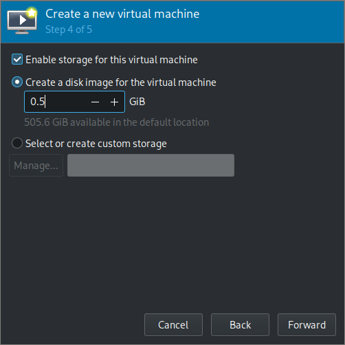

# Introduction
This is a step-by-step instruction how to create running [PenPoint OS](https://en.wikipedia.org/wiki/PenPoint_OS) environment.

It will use a [modified version of QEMU](https://github.com/khnsky/qemu-penpointos), a [libvirt](https://wiki.archlinux.org/title/Libvirt) client ([virt-manager](https://wiki.archlinux.org/title/Virt-Manager) in my case but any should do), and [FreeDOS](https://www.freedos.org/).  
In the guide I will be using [Arch Linux](https://archlinux.org/) and be linking to [ArchWiki](https://wiki.archlinux.org/) but it should work similarily for other distributions.

# Table of Contents
- [Creating the VM](#1-creating-the-vm)
- [Installing PenPoint](#2-installing-penpoint)
- [Building modfied QEMU](#3-building-modified-qemu)

# 1. Creating the VM
Download [FreeDOS 1.3 LiveCD](https://www.freedos.org/download/) and unzip it.
```
$ unzip FD13-LiveCD.zip
Archive:  FD13-LiveCD.zip
  inflating: FD13BOOT.img
  inflating: FD13LIVE.iso
  inflating: readme.txt
```
Install QEMU and libvirt client
```
$ sudo pacman -S qemu-desktop libvirt virt-manager
```
and start the libvirtd service.
```
$ systemctl start libvirtd.service
```

1. Start virt-manager. If 'QEMU/KVM' is grayed out double click to connect.  
2. From the drop-down menu select 'File -> New Virtual Machine'.  
3. Select 'Local install media' and click 'Forward'.  
4. Select unzipped FD13LIVE.iso by clicking 'browse' -> 'Browse local'.
5. Unselect 'Automatically detect from installation media/source', type 'FreeDOS', select 'FreeDOS 1.2' and click 'Forward'.  
6. Set CPUs to 1 and click 'Forward'.  

7. Set disk image size to 500MB and click 'Forward'.  

8. Change name and select 'Customize configuration before install' and click 'Finish'.  
9. In 'Boot Options' select 'Enable boot menu'.
10. In 'NIC' click remove.  
11. Click 'Begin installation'.  
12. Using arrows select 'Install to harddisk' and press Enter.  
13. Choose language and press Enter.  
14. Select 'Yes - Continue with the installation' and press Enter.  
15. Select 'Yes - Partition drive C:' and press Enter.  
16. Select 'Yes - Please reboot now' and press Enter.  
17. Unfortunately now the installation disk is ejected and the virtual machine cannot boot, from the drop-down menu select 'Virtual Machine -> Shutdown -> Force Off' and confirm by clicking 'Yes'.  
18. In the 'Show virtual hardware details' tab the IDE CDROM 1 is empty, click 'Browse', select FD13LIVE.iso, and confirm by clicking 'Choose Volume'.   
19. Click 'Apply' and power on the virtual machine by clikcing the triangle below 'Virtual Machine' menu button.
20. Press Esc to access boot menu and press 3 to select DVD/CD (FD13-LiveCD)  
21. Select using arrows 'Install to harddisk', and then language. This looks like repeating steps but it is not.  
22. Select 'Yes - Continue with the installation'.  
23. Select 'Yes - Please erase and format drive C:'  
24. Select keyboard layout.  
25. Select 'Full installation including applications and games'.  
26. Select 'Yes - Please install FreeDOS 1.3'.  
27. After installation finishes select 'Yes - Please reboot now' and press Enter.  

Installation of FreeDOS is now complete, you can use `shutdown` command to power off.  

# 2. Installing PenPoint
1. Download the [floppy images](floppies/) of PenPoint installation media. The files were obtained from [bitsavers.org](http://bitsavers.trailing-edge.com/bits/Go/PENPOINT_SDK/IMD/) and converted from .IMD to .img using [disk-utilities](https://github.com/keirf/disk-utilities).
2. In the 'Show virtual hardware details' tab click 'Add hardware'.
3. In 'Storage' tab select 'Select or create custom storage' and choose 'Device type' to be 'Floppy device'. Confirm by clicking 'Finish'.
4. Select 'Floppy 1' and click 'Browse' and 'Browse local' to find the first floppy image file. Confirm by clicking 'Apply'.
5. Boot the VM.
6. Navigate to the contents of the floppy by writing 'a:' and pressing Enter.
7. Run 'install.exe'.
8. An installation wizard will apear, press any keys (other than Esc) to proceed throuh it.
9. Select 'Drive C:' as the location to install PenPoint (white background is the one selected).
10. Press Enter to confirm the root directory to install PenPoint in.
11. Press Enter to start installation.
12. After first disk finishes installing a dialog will appear asking to insert next floppy drive. Go to the 'Show virtual hardware details tab' and in 'Floppy 1' set 'Source path' to location of the next disk, and click 'Apply'.
13. Go back to the 'Show graphical console' tab and press any key (other than Esc) to continue installation from the next disk.
14. Repeat for all 8 disks.
15. After all 8 disks were installed a dialog about creation of AUTOEXEC.NEW file will appear, press any key to continue.
16. After pressing keys to continue you will be dropped into command line in 'C:\PENPOINT', type 'cd ..' to go back to root.
17. Using either 'edit' or 'vim' text editors modify file 'FDAUTO.BAT' to include lines from file 'AUTOEXEC.NEW' created by the install wizard
```
PATH=C:\PENPOINT\SDK\UTIL\DOS;%PATH%
SET INCLUDE=.;C:\PENPOINT\SDK\INC
SET LIB=C:\PENPOINT\SDK\LIB
SET PENPOINT_PATH=C:\PENPOINT
```
Adding ';%PATH' at the end of 'PATH=...' makes so that programs included with FreeDOS can still be used normally.

18. Edit 'FDCONFIG.SYS' so that it looks like this:
19. Remove 'AUTOEXEC.NEW' and 'CONFIG.SYS' using `del autoexec.new config.sys`.
20. Reboot using `reboot`.
21. Navigate to 'C:\PENPOINT\BOOT' using `cd penpoint\boot`
22. Open file 'MIL.INI' in text editor and uncomment line containing 'PS2Mouse=on' by deleting the leading '#'.
23. Navigate to 'C:\PENPOINT\SDK\UTIL\DOS' and run 'GO.BAT'.

You now have running PenPoint OS (SDK). To exit PenPoint click 'Settings -> Power -> Manual shutdown'.

# 3. Building modified QEMU
To build QEMU you will probably need to install some packages. One way to find out what packages you need is to look how QEMU in your distribution's repositories is being built. As I am using Arch Linux I looked what the [AUR](https://aur.archlinux.org/) (Arch User Repository) package for building QEMU from master - [qemu-git](https://aur.archlinux.org/packages/qemu-git) - especially its [PKGBUILD](https://aur.archlinux.org/cgit/aur.git/tree/PKGBUILD?h=qemu-git)

1. Clone the repository for [modified QEMU](https://github.com/khnsky/qemu-penpointos):
```
$ git clone 'https://github.com/khnsky/qemu-penpointos.git'
```
2. Navigate to the cloned QEMU source directory, and create a build directory inside:
```
$ cd qemu-penpoint
$ mkdir build
$ cd build
```
3. Run the configure script:
```
$ ../configure --target-list=x86_64-softmmu --disable-werror
```
If configure script fails you might have some environmental variables like `$CFLAGS` set that interfere with it.  
4. and run 'ninja' to build:
```
$ ninja
```
5. Use 'virsh' to edit the configuration of the virtual machine so that it uses the freshly built modified QEMU.
```
$ sudo EDITOR=nvim virsh edit --domain PenPointOS
```
Use any editor you like by setting the `$EDITOR` environmental variable. The argument to `--domain` is the name of the virtual machine.  
6. Find the '<emulator>' element and change its value to the path of the new binary.
```xml
    <emulator>/home/khnsky/code/penpoint/qemu-penpointos/build/qemu-system-x86_64</emulator>
```
'virsh' performs some error cheking so that it will tell you if you made syntax errors in the configuration xml or if the QEMU binary lacks necessary features.
  
You now have a virtual machine with PenPoint OS (SDK) installed in FreeDOS that uses a modified QEMU binary that allows to use a graphics tablet in PenPoint.

